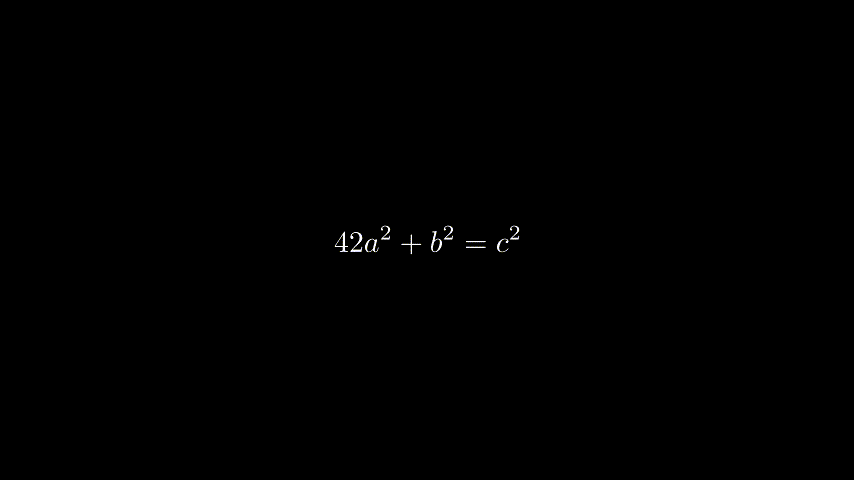

- [Manim Tutorial](#manim-tutorial)
  * [Quick Start](#quick-start)
    + [Step1: Install uv](#step1-install-uv)
    + [Step 2: Install Manim and Latex](#step-2-install-manim-and-latex)
    + [Step 3: Check installation](#step-3-check-installation)
  * [Beginner](#beginner)
  * [Intermediate](#intermediate)

# Manim Tutorial

> It is recommended to start from ManimCE (renders to mp4), and then move on to ManimGL for interactive rendering and more advanced features.

## Quick Start

### Step1: Install uv

[`uv`](https://github.com/astral-sh/uv) is an extremely fast Python package and project manager, written in Rust.

```
$ uv venv
$ uv sync
```

### Step 2: Install Manim and Latex

Windows:

- Miktex: https://miktex.org/download

Linux:

```
$ sudo apt install texlive-full
```

### Step 3: Check installation

```
# Windows
$ .venv\Scripts\activate

# Linux
$ source .venv/bin/activate

$ uv run manim checkhealth
```


## Beginner

> [!IMPORTANT]
> Don't forget to activate the virtual environment before running examples.

```
$ manim -pql tutorial_01.py TextDemo
```


```
$ manim -pql tutorial_02.py SquareAndCircle 
```


```
$ manim -pql tutorial_03.py SquareToCircle
```


```
$ manim -pql tutorial_04.py AnimatedSquareToCircle
```


```
$ manim -pql tutorial_05.py CircleAnnouncement --format gif
```


```
$ manim -pql tutorial_06.py AnimateSyntax --format gif
```


```
$ manim -pql tutorial_07.py CauchyIntegralFormula --format gif
```


```
$ manim -pql tutorial_08.py TransformEquation --format gif
```




## Intermediate
